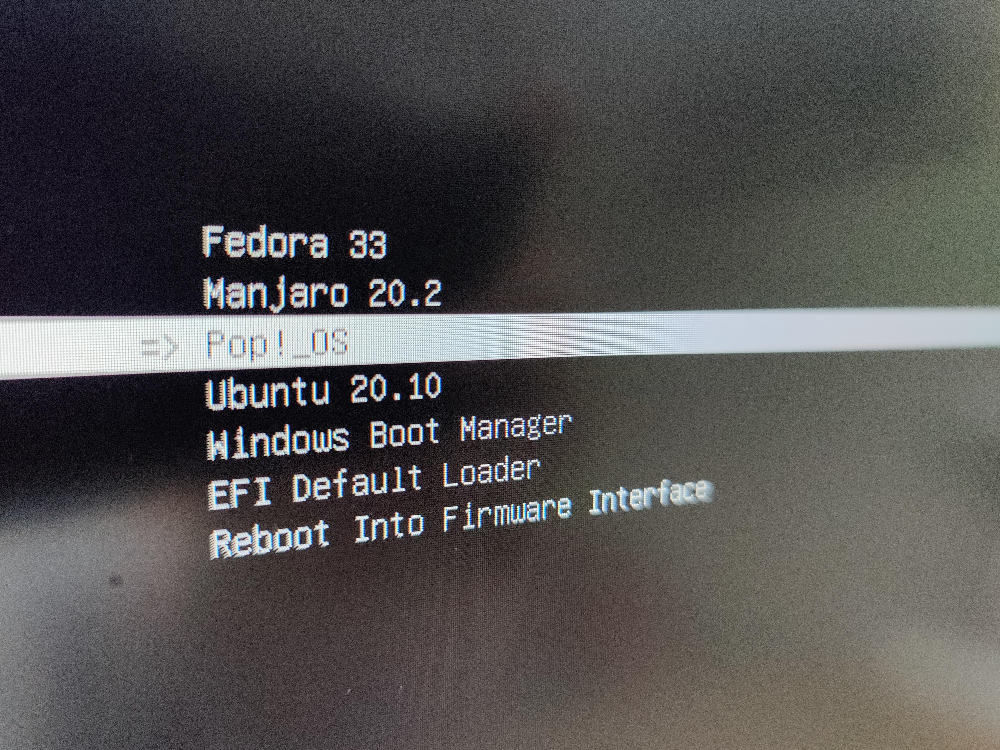

# How to choose OS to boot on reboot when using systemd-boot (Pop!_OS)



For adding an entry to the boot menu for an OS, please see [here](https://github.com/spxak1/weywot/blob/main/Pop_OS_Dual_Boot.md#22-how-to-add-an-option-for-windows-in-pop_os-boot-menu)

When all OSs use the same ```/boot/efi``` partition, systemd-boot will only automatically pick up three of them: Pop (new+old kernel), Windows and one of grub based distros (as Linux boot manager). 

This means you need to create small loader files in ```/boot/efi/loader/entries``` for all to display. The process is very simple, you only need a **name** and the ***UUID** of the root partition.

Here's an example of the entry I've made for Fedora, in the file ```Fedora.conf```.

~~~
title Fedora 33
linux /EFI/fedora/grubx64.efi 
options root=UUID=62a337f0-ae6b-4d17-83bb-8f1b86345e20 ro loglevel=0 splash
~~~

Once you have all your little ```OS_Name.conf``` files, you do a quick check to see what their ID's are with ```bootctl list```

Here's mine:

~~~
Boot Loader Entries:
        title: Fedora 33
           id: Fedora.conf
       source: /boot/efi/loader/entries/Fedora.conf
        linux: /EFI/fedora/grubx64.efi
      options: root=UUID=62a337f0-ae6b-4d17-83bb-8f1b86345e20 ro loglevel=0 splash

        title: Fedora 33 Rawhide
           id: FedoraR.conf
       source: /boot/efi/loader/entries/FedoraR.conf
        linux: /EFI/fedoraR/grubx64.efi
      options: root=UUID=a9309eb6-e4c7-4ecd-a98a-1a0ce6326299 ro loglevel=0 splash

        title: Manjaro 20.2
           id: Manjaro.conf
       source: /boot/efi/loader/entries/Manjaro.conf
        linux: /EFI/Manjaro/grubx64.efi
      options: root=UUID=e6d32909-cf87-45c2-bedd-f0a76ab9bbdb ro loglevel=0 splash

        title: Pop!_OS (Pop_OS-current.conf) (default)
           id: Pop_OS-current.conf
       source: /boot/efi/loader/entries/Pop_OS-current.conf
        linux: /EFI/Pop_OS-78c9787f-1d36-42e8-89bd-7b94b501afaf/vmlinuz.efi
       initrd: /EFI/Pop_OS-78c9787f-1d36-42e8-89bd-7b94b501afaf/initrd.img
      options: root=UUID=78c9787f-1d36-42e8-89bd-7b94b501afaf ro quiet loglevel=0 systemd.show_status=false rootflags=subvol=@ splash resume=UUID=78c9787f-1d36-42e8-89bd-7b94b501afaf resume_offset=7869696

        title: Pop!_OS (Pop_OS-oldkern.conf)
           id: Pop_OS-oldkern.conf
       source: /boot/efi/loader/entries/Pop_OS-oldkern.conf
        linux: /EFI/Pop_OS-78c9787f-1d36-42e8-89bd-7b94b501afaf/vmlinuz-previous.efi
       initrd: /EFI/Pop_OS-78c9787f-1d36-42e8-89bd-7b94b501afaf/initrd.img-previous
      options: root=UUID=78c9787f-1d36-42e8-89bd-7b94b501afaf ro quiet loglevel=0 systemd.show_status=false rootflags=subvol=@ splash resume=UUID=78c9787f-1d36-42e8-89bd-7b94b501afaf resume_offset=7869696

        title: Pop!_OS recovery
           id: Recovery-7827-FA9E.conf
       source: /boot/efi/loader/entries/Recovery-7827-FA9E.conf
        linux: /EFI/Recovery-7827-FA9E/vmlinuz.efi
       initrd: /EFI/Recovery-7827-FA9E/initrd.gz
      options: boot=casper hostname=recovery userfullname=Recovery username=recovery live-media-path=/casper-7827-FA9E live-media=/dev/disk/by-partuuid/a9fbe686-9f08-487c-9bc9-db094845b8c2 noprompt

        title: Ubuntu 20.10
           id: Ubuntu.conf
       source: /boot/efi/loader/entries/Ubuntu.conf
        linux: /EFI/ubuntu/grubx64.efi
      options: root=UUID=6496be90-810c-4b5c-bc7f-624aa51c5d9d ro loglevel=0 splash

        title: Windows Boot Manager
           id: auto-windows
       source: /sys/firmware/efi/efivars/LoaderEntries-4a67b082-0a4c-41cf-b6c7-440b29bb8c4f

        title: Reboot Into Firmware Interface
           id: auto-reboot-to-firmware-setup
       source: /sys/firmware/efi/efivars/LoaderEntries-4a67b082-0a4c-41cf-b6c7-440b29bb8c4f
~~~

You can **reboot** to any of those by typing:

```systemctl reboot --boot-loader-entry=Fedora.conf``` for Fedora,

```systemctl reboot --boot-loader-entry=auto-windows``` for Windows

```systemctl reboot --boot-loader-entry=Manjaro.conf``` for Manjaro

```systemctl reboot --boot-loader-entry=auto-reboot-to-firmware-setup``` for the Bios.
